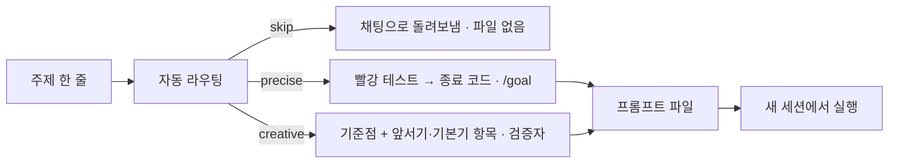

# metaprompt

**주제 한 줄 → 다른 세션에서 실행할 프롬프트 파일 하나**, 또는 "만들 필요 없음" 한 줄. Claude Code 플러그인.



## 언제 쓰나

**쓸 때 — 한 세션으로 안 끝나고, 채점할 수 있는 작업**

- 여러 파일·구성요소에 걸친 새 앱·도구, 출시·공개할 화면 → **creative** 프롬프트
- 원인 모를 버그 · 마이그레이션 · 수치 목표 → **precise** 프롬프트

**쓰지 않을 때 — 그냥 채팅에 시킨다** (주제를 줘도 스킬이 파일 없이 돌려보낸다)

- 오타 · 설정값 하나 같은 한 줄 수정, 질문, 코드 리뷰, 탐색
- 단일 HTML · 스크립트 하나처럼 **한 세션이 혼자 끝낼 그린필드 작업** — 아래 실측이 근거다
- 채점할 방법이 없는 산출물

```
/metaprompt 팀 스프린트 보드 웹앱 — API·DB·프론트까지, Linear 보다 빠른 키보드 조작
```

## 실측 — 작은 작업은 왜 채팅으로 보내나

같은 주제를 채팅과 lite 로 돌려 비교했다. 테스트와 채점표는 결과물을 보기 **전에** 확정했고, 채점은 이름표를 가린 별도 에이전트가 실제 클릭·키 입력으로 했다. 수치와 한계는 [bench/lab-2026-09-30.md](bench/lab-2026-09-30.md).

**스프레드시트 UI, 단일 HTML 파일** — 조건마다 2~3회. opus · `--effort medium` (lite 0.3.0 의 한 회만 빌더가 sonnet).

| 조건 | 핵심 63 | 확장 34 | 블라인드 심사 (20점) | 비용 | 시간 |
|---|---|---|---|---|---|
| 채팅 한 번 (3회) | 63 | 31–33 | 10–13 | $1.9–2.4 | 9–11분 |
| 채팅 + "개선버전도 만들어줘" (2회) | 63 | 34 | 15–18 | $6.4–6.8 | 17–27분 |
| lite 0.3.0 (2회) | 63 | 27 | 7–11 | $2.3–3.2 | 11–12분 |
| lite 현재 (2회) | 63 | 33–34 | 16–18 | $5.3–6.7 | 26–27분 |

- **0.3.0 의 lite 는 채팅보다 나빴다.** 빌더가 프롬프트를 닫힌 명세로 읽어 저장 · 숫자 입력 해석이 빠졌고, 검증자는 빌더가 돌린 프로브를 다시 돌려 5/5 를 줬다. 같은 프롬프트를 opus 로 다시 돌려도 같은 7개를 틀렸다 — 원인은 모델이 아니라 프롬프트였다.
- **고쳤다:** 체크리스트에 `기본기:` 항목, "이 파일은 명세가 아니라 바닥" 선언, 검증자가 체크리스트를 읽기 전에 실제 입력으로 써 보는 콜드 패스, 시작 커맨드에 `--model`.
- **고친 lite 는 심사에서 채팅 한 번을 앞섰지만, 채팅에 개선 요청을 한 번 더 한 것과 같은 수준 · 같은 비용이다.** lite 가 더하는 것은 사람 개입 없이 끝난다는 점뿐이다. 그래서 이 크기는 skip 으로 돌려보내고, lite 는 `--route` 로 직접 고를 때만 만든다.
- 0.3.0 스킬로 잰 다른 두 주제 (각 1회): 정렬 시각화는 중립 채점표 7/8 대 7/8 에 lite 비용 2.1배, CSV 파서는 둘 다 차등 퍼즈 만점에 precise lite 비용 4.4배.
- **아직 재지 않은 것:** 한 세션으로 안 끝나는 크기(standard · max)와 기존 저장소 작업(worktree). 스킬이 값을 한다면 그 구간인데, 근거는 아직 없다.

0.3.0 에 실었던 캘린더 표 — **lite 프롬프트의 체크리스트로 채점해 lite 에 유리했다.** 비용 · 시간만 참고한다 (원자료 `bench/chat-vs-lite/`).

| | 채팅 | lite (생성+실행) |
|---|---|---|
| lite 의 체크리스트 통과 | 0/5 | 5/5 |
| 비용 `total_cost_usd` · 시간 `duration_ms` | $1.07 · 3분 48초 | $2.56 · 8분 54초 |
| 출력 토큰 `modelUsage` | 27,628 | 56,793 |

## 경로 3개

플래그 없이 판정한다. **크기가 신호보다 먼저다** — 한 세션 크기면 creative·precise 신호가 있어도 skip. 그 뒤 신호가 팽팽하면 가벼운 쪽(skip < precise < creative). `--route` 로 고정, `--route-only` 는 판정 한 줄만.

| | skip | precise | creative |
|---|---|---|---|
| 파일 | 없음 — 채팅 지시 한 줄 | 있음 | 있음 |
| 기준점 | — | base commit · 명세 조항 | 실명 제품·방법 + 수치 |
| 생성 시 리서치 | — | 0 (저장소 사실만) | 티어 R 만큼 리서처 |
| 먼저 박는 것 | — | 실패하는 회귀 테스트 → 잠금 | `앞서기:` (기준점에 없는 것) + `기본기:` (주제가 함의하는 것) |
| 채점 | — | 종료 코드 + `/goal` 평가자, 검증자는 마지막 1회 | 새 컨텍스트 검증자 매 라운드 — 실제 입력 콜드 패스 먼저 (+ standard+ 블라인드 심사자) |
| 종료 | — | 커맨드 종료 코드 0 | 전 항목 Yes (+ 블라인드 점수) |
| 루프 | — | `/goal` | 내부 라운드 |

도메인(product · research · system)은 경로가 아니라 **증거 방법**이다 — 렌더 · 재현/반증 · 계측.

## 티어 — 크기와 토큰

한 세션 크기는 티어 전에 skip 으로 빠진다. 그 밖에 신호가 없으면 lite. "공개·팀·배포" → standard, "출시·경쟁 제품 옆·논문·SOTA" → max. `--tier` 로 고정.

| 키 (lite/standard/max) | 값 |
|---|---|
| 라운드 상한 | M 2/3/5 |
| 동시 팬아웃 | K 0/3/5 |
| 정체 판정 연속 라운드 | S 2/2/3 |
| 체크리스트 항목 | C 4-5 / 6-7 / 7-8 |
| 생성 시 리서치 에이전트 (creative) | R 0/1/3 |
| 체크포인트 | Q 1/2/2 |

티어가 깎는 것은 깊이다. 기준점 · 채점자 분리 · Yes/No 체크리스트 · 정체 감지 · 수용된 제약은 lite 에도 남는다.

## 실행 규약 — 역할 · 모델 · 스위치

- 역할마다 model(별칭) 과 effort. 값의 **유일한 출처**는 [`references/contract.md`](skills/metaprompt/references/contract.md) 다.
- Agent 도구에는 effort 파라미터가 없고, 세션 도중 만든 에이전트 정의는 그 세션에 로드되지 않는다 → `scripts/agents.py` 가 **세션 시작 전에** 역할 표를 `.claude/agents/mp-*.md` 로 만든다.
- 시작 커맨드에 `--model` 을 반드시 넣는다 — 빼면 계정 기본 모델로 떠서 빌더가 검증자보다 작은 모델이 된다 (실측).
- 기능 스위치는 프롬프트마다 값과 이유 한 줄: **agent teams** 는 대화형 · standard+ · 서로 반박해야 하는 독립 흐름 ≥3 일 때만 (약 7배 토큰) · **Workflow** 는 사람이 `ultracode` 를 치고 독립 증거 실행 ≥5 일 때만 · **루프** 는 검증 한 번이 ≥15분이면 `/loop`, 종료가 종료 코드면 `/goal`, 그 외 내부 라운드.

```bash
python3 <skill_dir>/scripts/agents.py prompts/metaprompt-<슬러그>.md   # 역할 정의 — 세션 시작 전에
claude --model opus --effort <메인 effort>
```

## 설치

```
/plugin marketplace add rotcoffee/metaprompt
/plugin install metaprompt@metaprompt
```

플러그인 시스템 없이 개인 스킬로:

```bash
git clone https://github.com/rotcoffee/metaprompt ~/metaprompt
ln -s ~/metaprompt/skills/metaprompt ~/.claude/skills/metaprompt
```

확인: `/metaprompt --check`. 플러그인으로 설치했다면 같은 이름의 개인 스킬(`~/.claude/skills/metaprompt`)은 지운다 — 트리거가 겹친다.

## 사용

`/metaprompt <주제> [--tier lite|standard|max] [--route creative|precise] [--route-only] [--profile product|research|system] [--mode greenfield|worktree] [--yes] [--from <이전 프롬프트>] [--out <경로>]`

## 개발

```bash
python3 skills/metaprompt/scripts/check_prompt.py --self-test   # 구조 · 픽스처 · 음성 케이스
python3 skills/metaprompt/scripts/check_prompt.py --repo .      # 버전 3곳 · README 수치 · 실측 원자료 대조
python3 skills/metaprompt/scripts/check_prompt.py prompts/*.md  # 생성물 검사
```

티어 수치 · 역할 · 스위치는 `contract.md` 한 곳에만 둔다 — 검사기가 그 표를 파싱한다. 라우팅 기대값은 `evals/routing.jsonl` (18건, `--route-only` 로 돌려 비교).

## 출처

[THIRD_PARTY_NOTICES.md](THIRD_PARTY_NOTICES.md). 구조와 규칙은 chanp5660/oneshot-prompt (MIT), 상호작용 방식은 obra/superpowers 의 brainstorming, 스킬 작성 원칙은 Anthropic 의 skill-creator 가이드(점진적 공개, "왜"를 설명하기, 반복 작업은 스크립트로)를 따랐다.

## 라이선스

MIT
