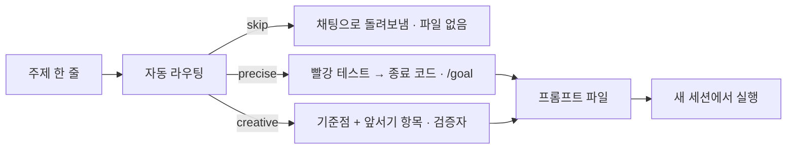

# metaprompt

**주제 한 줄 → 다른 세션에서 실행할 프롬프트 파일 하나** (또는 "만들 필요 없음" 한 줄). Claude Code 플러그인. 만든 프롬프트를 실행하지는 않는다.



| 주제 | 쓰나 | 결과 |
|---|---|---|
| 새 화면·도구·API·방법, "○○보다 나은" | 쓴다 | creative 프롬프트 |
| 원인 불명 버그 · 마이그레이션 · 수치 목표 · 재현 | 쓴다 | precise 프롬프트 |
| 한 문장 diff · 질문 · 코드 리뷰 · 탐색 · 30분 안쪽 | 쓰지 않는다 | skip — 채팅에 붙일 지시 한 줄, 파일 없음 |

가장 가벼운 실행 (플러그인 설치 시 이름은 `/metaprompt:metaprompt`):

```
/metaprompt 업무용 캘린더 UI, 단일 HTML --tier lite
```

## 채팅 vs lite 실측

<!-- BENCH-TABLE -->

## 경로 3개 — 무엇이 켜지고 꺼지나

플래그 없이 판정한다. 두 경로 신호가 팽팽하면 가벼운 쪽(skip < precise < creative). `--route` 로 고정, `--route-only` 는 판정 한 줄만.

| | skip | precise | creative |
|---|---|---|---|
| 파일 | 없음 — 채팅 지시 한 줄 | 있음 | 있음 |
| 기준점 | — | base commit · 명세 조항 | 실명 제품·방법 + 수치 |
| 생성 시 리서치 | — | 0 (저장소 사실만) | 티어 R 만큼 리서처 |
| 먼저 박는 것 | — | 실패하는 회귀 테스트 → 잠금 | `앞서기:` 항목 (기준점에 없는 것) |
| 채점 | — | 종료 코드 + `/goal` 평가자, 검증자는 마지막 1회 | 새 컨텍스트 검증자 매 라운드 (+ standard+ 블라인드 심사자) |
| 종료 | — | 커맨드 종료 코드 0 | 전 항목 Yes (+ 블라인드 점수) |
| 루프 | — | `/goal` | 내부 라운드 |

도메인(product · research · system)은 경로가 아니라 **증거 방법**이다 — 렌더 · 재현/반증 · 계측.

## 티어 — 크기와 토큰

신호가 없으면 lite. "공개·팀·배포" → standard, "출시·경쟁 제품 옆·논문·SOTA" → max. `--tier` 로 고정.

| 키 (lite/standard/max) | 값 |
|---|---|
| 라운드 상한 | M 2/3/5 |
| 동시 팬아웃 | K 0/3/5 |
| 정체 판정 연속 라운드 | S 2/2/3 |
| 체크리스트 항목 | C 4-5 / 6-7 / 7-8 |
| 생성 시 리서치 에이전트 (creative) | R 0/1/3 |
| 체크포인트 | Q 1/2/2 |

티어가 깎는 것은 깊이다. 기준점 · 채점자 분리 · Yes/No 체크리스트 · 정체 감지 · 수용된 제약은 lite 에도 남는다.

## 역할별 모델·effort

- Agent 도구에는 effort 파라미터가 없다 → effort 는 에이전트 정의 frontmatter 로만 준다.
- 세션 도중 만든 정의는 그 세션에 로드되지 않는다 → 생성된 프롬프트의 역할 표를 `scripts/agents.py` 가 **세션 시작 전에** `.claude/agents/mp-*.md` 로 만든다.
- 스킬 자신의 리서처·스카우트는 플러그인 `agents/` 에 있다.
- 모델은 별칭(opus · sonnet · haiku)으로만 적는다. 검증자·심사자 opus, 워커·리서처·스카우트 sonnet, 콜드 리더 haiku.

값의 **유일한 출처**는 [`references/contract.md`](skills/metaprompt/references/contract.md) 다. 여기엔 표를 옮기지 않는다.

```bash
python3 <skill_dir>/scripts/agents.py prompts/metaprompt-<슬러그>.md   # 역할 정의 — 세션 시작 전에
claude --effort <메인 effort>
```

## 기능 스위치 — 프롬프트마다 값과 이유 한 줄

- **agent teams** — 대화형 · standard+ · 서로 반박해야 하는 독립 흐름 ≥3 일 때만 ON. 약 7배 토큰이라 그 외 OFF.
- **Workflow** — 사람이 `ultracode` 를 치고 독립 증거 실행 ≥5 일 때만 ON. 코어 빌드는 제외.
- **루프** — 종료가 종료 코드면 `/goal`, 외부 대기 ≥15분이면 `/loop`(간격 ≥20분), 그 외 내부 라운드.

## 설치

```
/plugin marketplace add rotcoffee/metaprompt
/plugin install metaprompt@metaprompt
```

플러그인 시스템 없이 개인 스킬로:

```bash
git clone https://github.com/rotcoffee/metaprompt ~/metaprompt
ln -s ~/metaprompt/skills/metaprompt ~/.claude/skills/metaprompt
```

확인: `/metaprompt --check`. 플러그인으로 설치했다면 같은 이름의 개인 스킬(`~/.claude/skills/metaprompt`)은 지운다 — 트리거가 겹친다.

## 사용

```
/metaprompt <주제> [--tier lite|standard|max] [--route creative|precise] [--route-only]
                   [--profile product|research|system] [--mode greenfield|worktree]
                   [--yes] [--from <이전 프롬프트>] [--benchmark <기준점>] [--rounds N] [--out <경로>]
```

`--yes` 는 체크포인트를 건너뛴다. `--from` 은 이전 프롬프트를 재사용해 티어를 올린다.

## 개발

```bash
python3 skills/metaprompt/scripts/check_prompt.py --self-test   # 구조·픽스처·음성 케이스
python3 skills/metaprompt/scripts/check_prompt.py --repo .      # 버전 3곳 · README 수치 · 실측 원자료 대조
python3 skills/metaprompt/scripts/check_prompt.py prompts/*.md  # 생성물 검사
```

티어 수치·역할·스위치는 `contract.md` 한 곳에만 둔다. 검사기가 그 표를 파싱하므로 규칙을 바꾸면 픽스처가 먼저 깨진다 — 그것이 정상이다.

## 맞지 않는 경우

- 한 문장으로 설명되는 수정 · 단순 질의응답 · 코드 리뷰 · 탐색 — 스킬이 skip 으로 돌려보낸다
- 채점할 방법이 없는 산출물
- 만든 프롬프트를 이 세션에서 바로 실행하고 싶을 때 — 이 스킬은 파일까지만 만든다

## 출처

[THIRD_PARTY_NOTICES.md](THIRD_PARTY_NOTICES.md). 구조와 규칙은 chanp5660/oneshot-prompt (MIT), 상호작용 방식은 obra/superpowers 의 brainstorming, 스킬 작성 원칙은 Anthropic 의 skill-creator 가이드(점진적 공개, "왜"를 설명하기, 반복 작업은 스크립트로)를 따랐다.

## 라이선스

MIT
